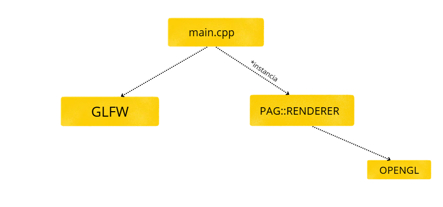
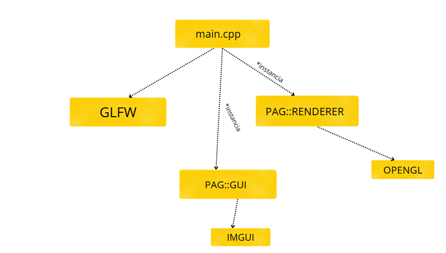

# PRACTICAS PROGRAMACIÓN DE APLICACIONES GRÁFICAS
## PRACTICA 1 PAG

### Explicación de la práctica 
He implementado el cambio del color con la rueda del ratón, haciendo que cuando se mueva la rueda se vaya sumando un número (en este caso he puesto que de arriba a abajo sea  el mismo para los tres colores y hacia los lados sean números distintos). Esta parte la he implementado en la función de callback scroll_callback. A continuación he añadido en el while del main en el que se gestionan los eventos glClearColor(r,g,b,1) poniendo los colores como constantes globales, y  glClear(GL_COLOR_BUFFER_BIT | GL_DEPTH_BUFFER_BIT). Por último al final de este while la función para el intercambio de ventanas (glfwSwapBuffers ( window )) para que se muestre el nuevo color pintado y glfwPollEvents (). 

### Respuesta reflexión

Para poder llamar a los métodos de la nueva clase y usarlos como callbacks, primero debemos crear un objeto de nuestra nueva clase. A continuación en la misma clase crearemos una función que, pasandole este objeto, llame a nuestra función nueva de refrescar ventana, usándola así como función puente. El punto está en que esta función puente debe ser estática, así C++ nos permitirá usarla en el registro del callback, quedando así:

*glfwSetWindowRefreshCallback ( window, PAG::Renderer::funcionpuente)*

## PRACTICA 2 PAG

### Explicación de la práctica 
En esta práctica se han realizado 3 cambios

- Primero hemos pasado toda la parte del main.cpp que tuviera que ver con OpenGl a una nueva clase Renderer, con un espacio de nombres propio llamado PAG. Esto nos permitirá poder reutilizar el main y otras clases en caso de que haya algún cambio y ya no se utilice más OpenGl sino otra API. Esto lo haremos siguiendo el patrón Singleton
Este patron nos dice que solo debe de haber una instacia de esa clase. Para ello, la creamos junto con una funcion getInstancia para recuperarla desde cualquier clase donde queramos usar alguna funcion de la clase Renderer. En esta clase haremos las distintas funciones que llamen a OpenGL y serán estas las que se llamen desde el main.

- Ahora descargamos ImGui y hacemos también una clase específica con su propia instancia. Crearemos dos ventanas flotantes, una para cambiar el color del fondo y otra para sacar el texto. Haremos lo mismo que con OpenGl, cualquier funcion de Imgui solo se llamará desde su clase con su instancia única.

- Modificaremos los callbacks del main para que en caso de estar haciendo alguna acción tocando las ventanas, no influya en las acciones que hemos programado con OpenGl (por ejemplo, si estamos haciendo click en el fondo, o moviendo la rueda del ratón). En este caso como no tenemos ninguna acción con Imgui, haremos un if que si se hace click en la ventana, salga de la función.
- Para que saque el texto por pantalla en vez de por consola, he creado una función que añade los mensajes a un vector, y en la ventana de los mensajes se irán mostrando con un for. Además he añadido un scroll para que se puedan visualizar los mensajes más antiguos, y un autoscroll para que srgún haya mensajes nuevos se vaya mostrando el más reciente. 

## PRACTICA 3 PAG
En esta práctica se han realizado diversos cambios con respecto a la anterior.

- Primero he creado las funciones necesarias para crear el shader program, y para crear el modelo que se pide, que en este caso es un triángulo. Para ello me he ayudad de las funciones que se me facilitan en el guión.

- A continuación, he hecho la comprobación de errores de las diversas funciones que se llamaban al crear el shader program. He realizado una pequeña modificación, ya que como quería sacar los errores por la ventana de texto creada en la práctica anterior, para que Renderer pueda usar Gui sin que esten enlazadas entre ellas, he hecho que la funcion de crear el shader program sea un bool al que se le pasa una cadena de texto error. De esta manera cuando ocurra algun error, la funcion sustituye la cadena de texto error por el texto del error y devuelve false (para que no siga ejecutando el programa nada), y en el main si la funcion de crear el shader program es false, llama automaticamente a la funcion addMensaje de Gui y le pasa el texto del error para que lo muestre en la ventana.

- Después he sustituido el texto que venía en la funcion con el codigo de los shaders. He pasado el texto a dos archivos que empiezan por pag03, y he hecho que desde renderer con una funcion para leer los archivos pueda utilizar estos códigos. Además, por si cambiase el prefijo de los archivos, se le ha pasado un parámetro a la funcion para que busque los archivos que tengan como inicio específicamentr "pag03". Si el archivo se llamase "pag04-vs.glsl" saltaría un error. Así si alguien lo quiere utilizar solo tiene que cambiar el prefijo con el que tengan sus archivos. 

- Por último he añadido color a los vértices, haciendo que estos se interpolen y salga un degradado. Esto lo hago añadiendo un atributo más al codigo del vertex shader, y un atributo de salida que se pasará al fragment shader, y este sacará en pantalla los colores. En el código del render para hacerlo no entrelazado, he hecho dos vectores distintos y he usado las funciones de cada uno de ellos por separado, sin embargo el entrelazado junto ambos en un mismo vector con altos y desplazamientos, que uso en cada función. 

- Con respecto a la pregunta que se hace, como cada vértice del triángulo tiene una posición asignada, por ejemplo al agrandar la ventana lo que pasa es que los píxeles se estiran, haciendo así que el mismo triángulo se estire a la vez, lo mismo si se hace más pequeña, los pixeles se encogen

